# Olá, eu sou o Fernando Henrique Pereira Fernandez!

## Engenheiro de Dados | Cientista de Dados | Desenvolvedor Back-End

  
  

Sou apaixonado por transformar dados brutos em inteligência de negócios e construir soluções de ponta a ponta (*End-to-End*). Tenho focado os meus estudos na estruturação de pipelines de dados, modelagem preditiva com Machine Learning / Deep Learning e desenvolvimento de APIs robustas para a entrega de soluções de inteligência artificial.

---

## Tecnologias e Ferramentas

### Linguagens & Core

### Engenharia de Dados, Big Data & Segurança

* **Arquitetura & LGPD:** Medalhão (Bronze, Silver, Gold), Pipelines escaláveis com PySpark, Técnicas de Ocultação de Dados (**Data Masking**).

### Ciência de Dados & IA Generativa

* **NLP & LLMs:** Modelos de Linguagem (Google Gemini, BERT), Hugging Face, Arquiteturas **RAG**.

### Desenvolvimento de Aplicações & APIs (SaaS)

* **Ferramentas:** Uvicorn, Plotly, Requisições de APIs (JSON), Estruturação de plataformas SaaS.

### Bancos de Dados & Armazenamento

---

## Projetos em Destaque

### [CredShield-SaaS](https://github.com/fernandez2312/CrediShield-SaaS)
* **Descrição:** Plataforma SaaS financeira de ponta a ponta (*End-to-End*) que automatiza a análise de risco de crédito integrada com inteligência artificial generativa.
* **Stack Técnica:** Backend robusto em `FastAPI`, banco de dados `MySQL`, e orquestração de dados seguindo a arquitetura `Medallion`.
* **Destaques de IA & Segurança:** Implementação de IA Generativa (`Gemini`) utilizando arquitetura `RAG` para consultas inteligentes e camada de segurança com ocultação de dados sensíveis (`Data Masking`).

### [Assistente de Recomendação com IA](https://github.com/fernandez2312/assistente-recomendacao-ia)
* **Descrição:** Sistema de IA Generativa utilizando arquitetura RAG (*Retrieval-Augmented Generation*), processamento de Embeddings (`Sentence-Transformers`) e cálculo de similaridade vetorial.
* **Interface:** Dashboard interativo construído em Streamlit.

### [Monitor de Preços IA](https://github.com/fernandez2312/monitor-precos-ia)
* **Descrição:** Pipeline completo de monitoramento e previsão de preços utilizando algoritmos de Machine Learning (`Scikit-Learn`).
* **Backend & UI:** API desenvolvida com FastAPI e Dashboard visual em Streamlit.

### [Pipeline de Análise de Sentimento](https://github.com/fernandez2312/pipeline-analise-sentimento)
* **Descrição:** Sistema de processamento de linguagem natural (NLP) focado na triagem inteligente de chamados de suporte ao cliente.
* **Modelos:** Modelos de Deep Learning baseados em Transformers (`BERT`).

### [Pipeline Medallion Databricks](https://github.com/fernandez2312/pipeline-medallion-databricks)
* **Descrição:** Engenharia de dados em larga escala utilizando `PySpark` e `Databricks` para estruturar dados seguindo a arquitetura de medalhão (Bronze, Silver e Gold).

### [Análise de Risco de Crédito](https://github.com/fernandez2312/Analise-risco-credito-mySQL)
* **Descrição:** Modelação estatística e preditiva para análise e manipulação de dados financeiros de forma a prever riscos de inadimplência, integrando consultas robustas em MySQL.

---

## Estatísticas do GitHub

---
